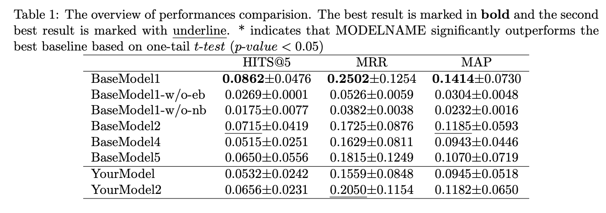
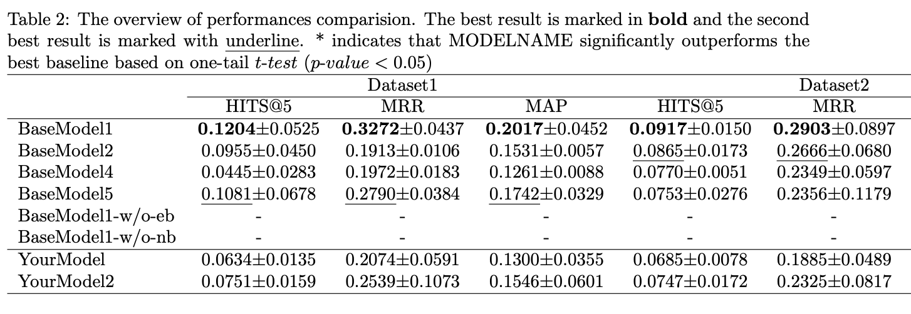

# PAPERUTILS

## results2table.py

This script auto summarise all experiment results into a latex table. It will report the `mean+s` for each method on each metric. The largest results will be marked with **boldface**, the second largest results will be marked with <u>underline</u>. It will also automatically perform a t-test to indicate whether your model is significantly outperforms baselines. The generated latex table code will automatically copy to your clipboard.

### Usage


```bash
python results2table.py --file <path/to/file> --sep ',' --model '[name1, name2]' --model_col 'model_col_name' --dataset 'dataset_col' --metric '[metricname1,metricname2,metric3]' --precision 4 --output <path/to/file>
```

* file (optional): Where your experiment results is stored. must be a `csv` file with header. default is `./data.csv`
* sep (optional): default is ','
* model: a list of your model names.
* model_col_name (optional): model column name. default is `model`
* dataset_col (optional): dataset column name. this will group experiments with different dataset. default is `None`
* metric: what metrics you want to show in the table. 
* precision (optional): How many decimal places to keep. default is `4`
* output (optional): Where to write the latex table code.

### example

1. One dataset:


2. Multi dataset:
